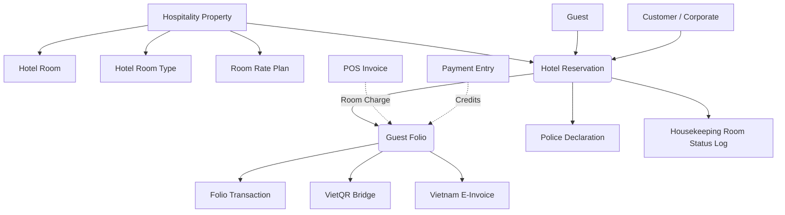

# Hospitality Core for ERPNext: The Native Hotel Management System


**Hospitality Core** is a modern, enterprise-grade Property Management System (PMS) engineered natively within the Frappe Framework for ERPNext. It transforms your ERPNext instance into a high-performance, single-source-of-truth solution for hotel, resort, and serviced apartment operations, eliminating fragile third-party integrations for core financial, inventory, and point-of-sale functions.

Built for single properties as well as multi-property hotel groups requiring strict corporate controls, real-time inventory deduction, Vietnamese statutory compliance (E-Invoice, VietQR, Police Declaration), and sub-second front office operations.

---

## 📖 Table of Contents

1. [**Core Philosophy: Control, Not Connectivity**](#-core-philosophy-control-not-connectivity)
2. [**Key Differentiators in v2.0**](#-key-differentiators-in-v20)
3. [**Feature Modules Deep Dive**](#-feature-modules-deep-dive)
   * [Modern Front Office Suite](#1-modern-front-office-suite)
   * [Housekeeping & Maintenance (Desktop & Mobile PWA)](#2-housekeeping--maintenance-desktop--mobile-pwa)
   * [Guest 360 CRM & Loyalty System](#3-guest-360-crm--loyalty-system)
   * [Financial Engine & Folio Management](#4-financial-engine--folio-management)
   * [VietQR NAPAS 247 Dynamic Payment](#5-vietqr-napas-247-dynamic-payment)
   * [Statutory Compliance: E-Invoice & Police Declaration](#6-statutory-compliance-e-invoice--police-declaration)
   * [Rate Engine v2 & Yield Management](#7-rate-engine-v2--yield-management)
   * [ERPNext Native Bridges (POS, Stock, F&B Cost Control)](#8-erpnext-native-bridges-pos-stock-fb-cost-control)
4. [**Operational Workflow Guides**](#-operational-workflow-guides)
5. [**Quality Assurance & Audit Passes (1 – 5)**](#-quality-assurance--audit-passes-1--5)
6. [**Technical Architecture & Core DocTypes**](#-technical-architecture--core-doctypes)
7. [**Installation & Configuration**](#-installation--configuration)
8. [**Documentation Index**](#-documentation-index)
9. [**UI Gallery**](#-ui-gallery)
10. [**License**](#-license)

---

## 💡 Core Philosophy: Control, Not Connectivity

**Hospitality Core** is built on the philosophy of **Strict Internal Control and Native Cohesion**. Instead of stitching together disparate cloud services with brittle webhooks and nightly sync jobs:
* **Finance is Live**: Every room charge, minibar consumption, or spa service instantly posts to the guest's folio and updates ERPNext general ledgers. No "end-of-day" synchronization failures.
* **Inventory is Immediate**: A beverage taken from a minibar immediately decrements stock in that specific room's dedicated stock warehouse.
* **Multi-Property Native**: Hotels and resorts under the same ERPNext instance operate with isolated property scopes (`Hospitality Property`), custom operating companies, independent tax codes, and separate bank accounts.
* **Double-Booking Immunity**: Strict database row-level locking (`SELECT ... FOR UPDATE`) prevents concurrent double-booking during peak check-in rushes.

---

## ✨ Key Differentiators in v2.0

* **Zero-Confusion Room Numbering**: Front desk staff, housekeeping, and POS cashiers interact exclusively with physical, human-readable room numbers (e.g. `101`, `VIP-202`) rather than internal database hash keys.
* **Tape Chart 2.0**: High-speed interactive timeline supporting drag-and-drop pre-arrival room reassignment (`Reserved`) and formal in-house room moves (`Checked In`) with automatic housekeeping dirty-marking.
* **Housekeeping Mobile PWA**: Attendants manage room cleanliness directly from smartphones with haptic feedback, one-tap status toggling (`Dirty` -> `Cleaning` -> `Clean` -> `Inspected`), and direct minibar posting.
* **VietQR NAPAS 247 Instant Settlement**: Automatic EMVCo QR code rendering supporting custom payment amounts (partial settlements, room deposits) linked directly to the property's operating bank account.
* **Vietnam Statutory Compliant**:
  - **Electronic Invoicing**: Seamless dual-mode integration (S-Invoice, VNPT, Viettel, M-Invoice) with strict separation of `seller_tax_code` and `buyer_tax_code`.
  - **Police & Immigration Temporary Residence**: 1-click XML and Excel report generation for local police and Vietnam Immigration Department (Cục Quản lý Xuất nhập cảnh), complete with ISO-3 country normalization (`VNM`/`FOR`).
* **Dynamic Rate Plan v2**: Multi-tiered pricing with Length-of-Stay (LOS) discounts, seasonal surcharges, early check-in, and late check-out fee automation.

---

## 🚀 Feature Modules Deep Dive

> **Path note**: paths below are written relative to the app package root
> (i.e. `hospitality_core/` here means
> `hospitality_core/hospitality_core/` on disk from the repo root — Frappe
> apps nest an inner package of the same name). Use `find`/your editor's
> "go to file" rather than a literal `cd hospitality_core/api/...`.

### 1. Modern Front Office Suite

#### Front Desk Console (`hospitality_core/page/front_desk_console/`)
* **Live Operational KPIs**: Real-time counters for Pending Arrivals, Pending Departures, In-House Occupancy, and Available Rooms. Clicking any KPI card dynamically filters the operational list.
* **Omni-Search Bar**: Instant debounced search across guest names, phone numbers, email addresses, booking confirmation codes, and physical room numbers (`101`, `202`).
* **Multi-Property Filtering**: Multi-site managers can switch between specific properties or view unified portfolio operations.

#### Tape Chart 2.0 (`hospitality_core/page/tape_chart/`)
* **Interactive Matrix**: Rooms on the Y-axis (grouped by room type) and dates on the X-axis.
* **Pre-Arrival Drag-and-Drop**: Drag reservations in `Reserved` status to reassign rooms without altering length of stay or triggering premature room-move billing.
* **In-House Room Move Dialog**: Moving a `Checked In` guest prompts for reason codes, preserves the folio history, automatically transitions the old room to `Dirty`, and updates the new room to `Occupied`.
* **Reservation Quick Drawer**: Clicking any reservation block exposes guest demographics, folio balance, meal plan, and one-click actions for Check-In, Print Registration Card, and Folio Settlement.

---

### 2. Housekeeping & Maintenance (Desktop & Mobile PWA)

#### Housekeeping Board (`hospitality_core/page/housekeeping_view/`)
* **Live Room Status Grid**: Real-time view of all property rooms categorized by Clean, Dirty, Cleaning, Inspected, Out of Order, and Out of Service.
* **Mobile-First PWA Mode**: Designed specifically for housekeeping attendants on iOS and Android devices:
  - Responsive cards with tactile tap targets and vibration (haptic) feedback.
  - One-tap status updates with instant synchronization to the Front Desk Console.
  - Direct minibar usage logging by physical room number.
  - Rapid maintenance defect reporting with photo upload.
* **Automated Room State Machine**:
  - Guest Check-In -> Room automatically becomes `Occupied`.
  - Guest Check-Out -> Room automatically becomes `Dirty`.
  - Maintenance Issue Reported -> Room automatically becomes `Out of Order`.
  - Maintenance Issue Resolved -> Room transitions to `Dirty` for sanitization.
  - Room Move -> Source room becomes `Dirty`, destination room becomes `Occupied`.

---

### 3. Guest 360 CRM & Loyalty System

#### Guest Profile & History (`hospitality_core/page/guest_360/`)
* **Unified Guest Record**: Consolidates profile data, identification documents (CCCD, Passport), vehicle registration, dietary and room preferences, lifetime reservations, and total spend.
* **Safe Profile Merging (`merge_guest_profiles`)**: Automatically merges duplicate guest records, repoints all historical folios and reservations, and safely transfers `Guest Membership` loyalty accounts.
* **Loyalty Points Ledger (`Guest Balance Ledger`)**: Accrual and redemption tracking per property and operating company, ensuring points liability is properly accounted for across corporate entities.

---

### 4. Financial Engine & Folio Management

#### Folio Architecture (`hospitality_core/api/folio.py`)
* **Master Bill Ledger (`Guest Folio`)**: Immutable financial record aggregating room rent, incidentals, restaurant charges, paid-outs, and credits.
* **Real-time Balance Synchronization (`sync_folio_balance`)**: Recalculates total charges, payments, taxes, and outstanding balance upon every transaction save or void.
* **City Ledger & Corporate Master Folio**: Split billing allows corporate guests to check out with zero balance while transferring company-liable expenses to a Master Corporate Folio for post-departure invoicing.
* **Void & Allowance Governance**: Transaction cancellations require pre-configured reason codes (`Allowance Reason Code`) with role-based manager authorization checks to prevent unauthorized write-offs.

---

### 5. VietQR NAPAS 247 Dynamic Payment

#### VietQR Engine (`hospitality_core/api/vietqr_bridge.py`)
* **EMVCo-Compliant QR Generation**: Generates compliant VietQR payloads for instant scanning via all Vietnamese banking and fintech apps.
* **Dynamic Amount Overwrite**: Supports ad-hoc deposit amounts or partial folio settlements at the front desk rather than forcing full balance payment.
* **Operating Company Context**: Automatically resolves bank account number, bank BIN, and beneficiary account name matching the folio's operating company.
* **Physical Room Reference**: Formats payment description automatically: `ROOM 101 - FOLIO-2026-00045`.

---

### 6. Statutory Compliance: E-Invoice & Police Declaration

#### Vietnam E-Invoice (`hospitality_core/api/einvoice.py`)
* **Compliant Data Structure**: Validated against Circular 78/2021/TT-BTC and Decree 123/2020/ND-CP.
* **Dual Tax Code Validation**:
  - `seller_tax_code`: Sourced strictly from the hotel's `operating_company`.
  - `buyer_tax_code`: Sourced from the customer/guest tax registration (`tax_id`).
* **Direct Integration**: Native adapters for S-Invoice, VNPT, Viettel, and M-Invoice.

#### Temporary Residence Declaration (`hospitality_core/api/police_declaration.py`)
* **Police XML & Excel Export**: Formatted to meet Vietnam Ministry of Public Security and Immigration Department specifications.
* **Automated Nationality Normalization**: Maps guest country records to ISO-3 standard (`VNM`, `FOR`) and verifies visa/passport details for foreign travelers.
* **Physical Room Attribution**: Room column populates physical room numbers (`101`, `202`) ensuring municipal immigration portals accept the batch file without rejection.

---

### 7. Rate Engine v2 & Yield Management

#### Dynamic Rate Plans (`hospitality_core/api/rate_plan.py`)
* **Flexible Rate Models**: Base rates configured on `Hotel Room Type` with date-range overrides on `Room Rate Plan`.
* **Length-of-Stay (LOS) Discounts**: Automatically applies discounts for extended stays (e.g. 5+ nights, 14+ nights).
* **Seasonal & Weekend Multipliers**: Define holiday and peak season price schedules.
* **Automated Early/Late Surcharges (`surcharge_engine.py`)**: Automatic calculation of half-day or hourly surcharges for check-ins before 14:00 or check-outs after 12:00.

---

### 8. ERPNext Native Bridges (POS, Stock, F&B Cost Control)

* **POS Room Charge Bridge (`pos_bridge.py`, `fnb/pos.py`)**: Restaurant and bar bills can be billed to guest rooms by entering physical room numbers. The system verifies active check-in status and mirrors items to the folio.
* **Stock & Minibar Deduction (`stock.py`)**: Items billed to a room automatically trigger a submitted `Stock Entry` (Material Issue) depleting inventory from the room's dedicated warehouse.
* **F&B Cost Control Engine**: Tracks recipe costs, theoretical vs. actual ingredient usage, and banquet event catering margins. See [F&B Cost Control Documentation](file:///d:/TCG-project/frappe/erpnext_hospitality_core/docs/fnb_cost_control_implementation_2026_09_08.md).

---

## 🗺️ Operational Workflow Guides

### 1. Individual Guest Flow (FIT)
1. **Booking**: Agent books via **Tape Chart 2.0** or **Front Desk Console**. System locks room row (`SELECT FOR UPDATE`), validates availability, and creates a `Guest Folio`.
2. **Check-In**: Guest arrives. Agent clicks **Check In**. Room transitions to `Occupied`, status changes to `Checked In`, and first night room charge is posted.
3. **In-House**: Guest consumes minibar or signs a restaurant bill to the room using physical room number `101`. Charges immediately appear on the folio and deduct warehouse stock.
4. **Settlement**: Agent clicks **VietQR** or **Pay**. Guest scans QR to transfer funds. Folio balance reaches zero.
5. **Check-Out**: Agent clicks **Check Out**. Room transitions to `Dirty` and queues on Housekeeping Mobile PWA.

### 2. Corporate Guest Flow (City Ledger)
1. **Reservation**: Reservation created with `is_company_guest = 1` and linked to corporate Customer account.
2. **Billing Routing**: Room charges route to the Company Master Folio, while incidentals remain on the guest's personal folio.
3. **Departure**: Guest settles personal incidentals at desk. Company charges transfer to accounts receivable on the Corporate Master Folio.

### 3. Pre-Arrival Room Reassignment vs. In-House Move
* **Pre-Arrival (`Reserved`)**: Receptionist drags reservation to another room on Tape Chart. Room is swapped instantly without modifying stay dates or generating accounting charges.
* **In-House (`Checked In`)**: Receptionist uses **Move Room** action. Old room becomes `Dirty`, new room becomes `Occupied`, and an audit log entry records the operational reason.

---

## 🛡️ Quality Assurance & Audit Passes (1 – 5)

Hospitality Core v2.0 has undergone 5 consecutive deep-dive code and business logic audits:

| Audit Pass | Focus Areas | Key Fixes Implemented |
| :--- | :--- | :--- |
| **Pass 1** | UI & Front Office | Fixed Tape Chart drag-and-drop context, mobile double-click prevention, CSS selector escaping |
| **Pass 2** | CRM & Identification | Fixed number formatting on Loyalty tab, normalized identification fields, Desk SPA hash preservation |
| **Pass 3** | Pre-Arrival & VietQR | Split pre-arrival room swap from in-house move, added VietQR custom amount overwrite, PWA physical room entry |
| **Pass 4** | Physical Room Resolution | Front Desk Console & Omni-Search room number resolution, POS Room Charge physical number binding, manager role guards |
| **Pass 5** | Regulatory & Multi-Property | Police Declaration physical rooms & ISO-3, E-Invoice seller/buyer tax code separation, room locking concurrency, auto housekeeping logs, group booking property inheritance |

👉 **Full Audit Report**: Read the complete breakdown of all 35+ bug fixes and verification logs in [Báo Cáo Tổng Hợp 5 Đợt Rà Soát (Audit Passes 1 – 5)](file:///d:/TCG-project/frappe/erpnext_hospitality_core/docs/audit_summary_passes_1_to_5.md).

### Unit Test Verification
All core calculations, rate plan tiers, and multi-property logic are continuously verified:
```bash
python -m unittest tests/test_rate_plan.py tests/test_property_calculation.py
# Ran 38 tests in 0.254s - OK (100% Passed)
```

---

## 🏗️ Technical Architecture & Core DocTypes



* `Hospitality Property`: Scope anchor for multi-property isolation, operating company, and regional defaults.
* `Hotel Reservation`: Central state machine controlling stay dates, guest assignment, rate calculation, and check-in/out status.
* `Hotel Room`: Physical room inventory linked to a room type, property, and ERPNext stock warehouse.
* `Guest Folio`: Accounting ledger containing itemized charges, payments, and balance tracking.
* `Folio Transaction`: Immutable transaction lines with item references, tax breakdowns, and audit tracking.
* `Guest Balance Ledger`: Segregated multi-property customer deposit and loyalty point ledger.

---

## 🛠️ Installation & Configuration

### Prerequisites
* Frappe Framework: v14 or v15
* ERPNext: v14 or v15 (with Accounts, Stock, and POS modules enabled)
* Python: 3.10 or 3.11

### Installation Steps
```bash
# 1. Fetch app into bench
cd /path/to/frappe-bench
bench get-app hospitality_core https://github.com/Gifted87/erpnext_hospitality_core.git

# 2. Install on target site
bench --site [your-site-name] install-app hospitality_core

# 3. Migrate database schema
bench --site [your-site-name] migrate

# 4. Restart bench services
bench restart
```

### Initial Configuration Checklist
- [ ] **Verify User Roles**: Assign `Hospitality User`, `Hospitality Manager`, and `Housekeeping Staff` roles.
- [ ] **Configure Hospitality Property**: Create properties and set the primary `operating_company`.
- [ ] **Set Up Room Types & Rooms**: Create types (Deluxe, Suite) and populate room numbers (`101`, `102`).
- [ ] **Map Service Items**: Confirm `ROOM-RENT`, `PAYMENT`, and `POS-CHARGE` exist and link to proper income accounts.
- [ ] **Configure VietQR**: Enter bank account details and BIN code in `Hospitality Accounting Settings`.
- [ ] **Verify Daily Night Audit**: Confirm scheduler hook runs at scheduled time (default `0 14 * * *`).

---

## 📚 Documentation Index

* [Báo Cáo Tổng Hợp 5 Đợt Rà Soát Lỗi Nghiệp Vụ (Passes 1 – 5)](file:///d:/TCG-project/frappe/erpnext_hospitality_core/docs/audit_summary_passes_1_to_5.md)
* [Thiết Kế Mở Rộng Đa Cơ Sở, Đa Tiền Tệ & Loyalty](file:///d:/TCG-project/frappe/erpnext_hospitality_core/docs/architecture/hospitality_multi_property_currency_loyalty.md)
* [F&B Cost Control Implementation](file:///d:/TCG-project/frappe/erpnext_hospitality_core/docs/fnb_cost_control_implementation_2026_09_08.md)
* [F&B Bugfix Verification Guide](file:///d:/TCG-project/frappe/erpnext_hospitality_core/docs/fb_bugfix_verification_2026_09_08.md)
* [Automated Print Service Troubleshooting](file:///d:/TCG-project/frappe/erpnext_hospitality_core/hospitality_core/AUTO_PRINT_TROUBLESHOOTING.md)

---

## 📸 UI Gallery


---

## 📄 License
This project is licensed under the **GNU General Public License v2.0**.
