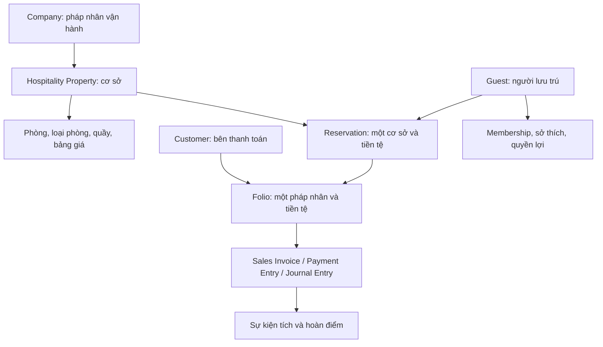

# Thiết kế mở rộng Hospitality: nhiều cơ sở, tiền tệ và CRM/loyalty

Ngày nghiên cứu: 06/09/2026. Trạng thái: đề xuất kiến trúc và kế hoạch triển khai, chưa thay đổi schema hoặc triển khai tính năng này lên site.

Tài liệu dựa trên mã nguồn Hospitality Core và ERPNext trong workspace, kết hợp tài liệu chính thức. Workspace đang có nhiều thay đổi chưa commit và một số file được sửa đồng thời; các nhận xét mô tả phiên bản đã đọc, không phải một bản phát hành cố định. Chưa truy cập cơ sở dữ liệu vận hành, chưa xác minh cấu hình thực tế của từng pháp nhân/cơ sở.

## 1. Kết luận thiết kế

Hospitality hiện chưa có mô hình đủ để vận hành nhiều cơ sở và nhiều tiền tệ an toàn. Tuy nhiên, không cần xây lại nền tảng kế toán, Customer hay toàn bộ loyalty: ERPNext đã có các thành phần cần tái sử dụng. Phần phải thiết kế mới là phạm vi nghiệp vụ khách sạn, cách truyền ngữ cảnh xuyên suốt giao dịch và các quy tắc riêng của khách lưu trú.

Đề xuất triển khai theo thứ tự:

1. Chốt mô hình pháp nhân/cơ sở và nguồn chứng từ kế toán; đưa dữ liệu hiện tại vào một cơ sở mặc định bằng bảng ánh xạ đã kiểm chứng.
2. Bổ sung phạm vi cơ sở, pháp nhân, phân quyền và cấu hình; thử hai cơ sở dùng cùng VND trước.
3. Mở giao dịch ngoại tệ sau khi đối soát được Folio, hóa đơn, thu tiền và chênh lệch tỷ giá.
4. Xây hồ sơ khách dùng lại, sở thích có phạm vi chia sẻ và quyền lợi hội viên.
5. Triển khai điểm theo từng pháp nhân trước; ví điểm dùng chéo pháp nhân là giai đoạn riêng với cơ chế quyết toán.

Không suy ra Cảng CPTC hay Đảo Hồng DHG là một Property chỉ vì đã xuất hiện trong luồng liên công ty. Cần xác nhận cơ sở nào do pháp nhân nào vận hành, xuất hóa đơn và thu tiền.

## 2. Bằng chứng hiện trạng

Các đường dẫn bên dưới tính từ gốc app `erpnext_hospitality_core`, trừ khi ghi rõ ERPNext.

| Phát hiện đã xác minh | Bằng chứng mã nguồn | Hệ quả thiết kế |
|---|---|---|
| `company` trên Reservation và Folio là Link tới **Customer** | `doctype/hotel_reservation/hotel_reservation.json`, `doctype/guest_folio/guest_folio.json` trong `hospitality_core/hospitality_core/` | Không được đổi trường này thành Link Company tại chỗ; dữ liệu đang mang nghĩa bên thanh toán |
| Hai Settings chính là Single, không có Company | JSON của `hospitality_accounting_settings`, `hospitality_channel_manager_settings`; các API gọi `frappe.get_single(...)` | Cấu hình tài khoản, kết nối và cơ sở mặc định đang dùng chung |
| Phòng lấy tên từ số phòng; loại phòng lấy tên từ tên loại | JSON `hotel_room`, `hotel_room_type` | Hai cơ sở có phòng 101 hoặc loại Deluxe cần mã định danh riêng và ràng buộc theo cơ sở |
| Schema app chưa có trường Link Currency hay chiều tiền tệ riêng cho giao dịch | Quét các JSON DocType; nhiều trường chỉ có fieldtype Currency | Kiểu hiển thị Currency không thay thế đồng tiền của chứng từ |
| Payment Entry đặt cả hai tỷ giá bằng 1 | `api/payment_bridge.py`, các chỗ `source_exchange_rate` và `target_exchange_rate` | Không thể bật ngoại tệ chỉ bằng cách thêm currency vào form |
| Hóa đơn lấy Company từ user/global default | `api/invoicing.py`, hàm tạo dữ liệu hóa đơn | Cùng một Folio có nguy cơ chọn pháp nhân theo người thao tác nếu mở nhiều Company mà giữ cách này |
| Guest Balance Ledger không có Company/currency | JSON `guest_balance_ledger` | Tiền còn dư của khách cần tách theo pháp nhân và tiền tệ trước khi tái sử dụng |
| Guest có nhãn VIP nhưng chưa có membership, preferences hay ledger điểm | JSON `guest`; `page/guest_360/guest_360.py`; controller `guest.py` | Nhãn VIP chưa phải chính sách quyền lợi; lịch sử chi tiêu chưa phải số dư điểm |
| Guest dùng `format:{full_name}` làm tên; tự tạo Customer khi thiếu | JSON/controller `guest` | Cần định danh ổn định, nhận diện trùng và phân biệt khách ở với bên trả tiền |
| Guest 360 cộng trực tiếp `total_charges` của Folio đóng | `page/guest_360/guest_360.py`, `guest.py` | Không thể dùng nguyên phép cộng này cho nhiều tiền tệ; tổng phí cũng chưa chứng minh là chi tiêu đủ điều kiện tích điểm |
| Push inventory/rate của Channel Manager vẫn được đánh dấu MOCK | `api/channel_manager.py`, `push_availability`, `push_rates` | Cấu hình nhiều cơ sở không đồng nghĩa đã có kết nối OTA sản xuất hoàn chỉnh |

“VND toàn hệ thống” là thông tin người dùng cung cấp. Đã xác minh thiếu chiều tiền tệ trong app; chưa kiểm tra Global Defaults, Company default currency và dữ liệu thực tế trên site để chứng minh mọi giao dịch hiện tại đều VND.

Ngoài hai Settings chính, phải rà cả surcharge, police declaration, VietQR, e-invoice, POS, kho và báo cáo. Không giới hạn phạm vi vào năm DocType được nêu ban đầu.

## 3. Company, Property và bên thanh toán

ERPNext Company là pháp nhân có sổ kế toán riêng. Property là cơ sở vận hành thuộc một pháp nhân trong một thời kỳ. Accounting Dimension có thể bổ sung phân tích theo Property, nhưng không thay thế Company. [Company](https://docs.frappe.io/erpnext/company-setup), [Accounting Dimensions](https://docs.frappe.io/erpnext/accounting-dimensions).

Các ràng buộc bắt buộc:

- Một Reservation thuộc một Property, một operating Company và một currency. Room, Room Type, Rate Plan và Reception phải tương thích với Property đó.
- Một Folio thuộc một Company, Property và currency. Hóa đơn và thu tiền lấy pháp nhân từ nguồn giao dịch, không lấy từ user default.
- Company/currency không đổi trực tiếp sau phát sinh tài chính. Chuyển cơ sở/pháp nhân cần giao dịch mới, liên kết nguồn và xử lý số dư minh bạch.
- Group Booking xuyên cơ sở có các booking con riêng. Không gom công nợ nhiều pháp nhân vào một master Folio rồi bù trừ nội bộ bằng dòng chuyển tiền thông thường.
- Chuyển khoản phí trong cùng Company/currency vẫn phải kiểm tra quyền với cả hai Folio. Chuyển khác Company dùng luồng liên công ty riêng.
- Khi pháp nhân vận hành một cơ sở thay đổi, giữ Company lịch sử trên giao dịch; dùng cấu hình có thời gian hiệu lực hoặc hồ sơ vận hành mới, không cập nhật ngược toàn bộ lịch sử.

ERPNext có chứng từ liên công ty. Việc chọn hóa đơn liên công ty hay cặp Journal Entry phụ thuộc loại nghiệp vụ; không tự động tạo đồng thời cả hai cho cùng sự kiện. [Inter Company Invoices](https://docs.frappe.io/erpnext/inter-company-invoices), [Inter Company Journal Entry](https://docs.frappe.io/erpnext/inter-company-journal-entry).

## 4. Schema mục tiêu và tương thích dữ liệu

Tên dưới đây là tên đề xuất, chưa phải DocType đã tạo.

| Thành phần | Thay đổi đề xuất | Quy tắc chính |
|---|---|---|
| Hospitality Property mới | code, name, operating_company, timezone, business-day rules, default selling currency, trạng thái | Mã ổn định; không dùng tên hiển thị làm khóa nghiệp vụ |
| Hotel Room | property, mã phòng ổn định; giữ room_number để hiển thị | Unique `(property, room_number)`; không bắt buộc đổi tên tất cả phòng cũ |
| Hotel Room Type | property | Mỗi cơ sở có cấu hình sức chứa và giá; mẫu dùng chung có thể thêm sau |
| Giá mặc định loại phòng | bảng giá theo `(room_type, currency)` | Cặp chưa cấu hình phải báo lỗi; không âm thầm dùng giá VND với nhãn USD |
| Room Rate Plan | property, currency; Company suy ra và xác thực | Season và LOS kế thừa currency từ plan; không trộn tiền tệ trong bảng mùa vụ |
| Hotel Reception | property | Quầy/điểm làm việc không thay thế Property |
| Reservation | property, operating_company, currency, billing_customer; mở rộng snapshot giá | Giữ `company` cũ như trường tương thích trong thời gian chuyển đổi |
| Guest Folio | property, operating_company, currency, billing_customer | Currency của số dư cố định; Company của bên thu tiền được xác định rõ |
| Folio Transaction | amount/currency gốc, base amount, FX evidence, nguồn chứng từ, business date | Phát sinh kế toán dùng tỷ giá đã chốt theo chứng từ, không tính lại bằng tỷ giá hiện tại |
| Guest Balance Ledger | company, currency, nguồn Payment Entry và phân bổ | Không dùng số dư khác pháp nhân/tiền tệ như cùng một ví |
| Group Booking | cơ sở cho booking đơn; bản điều phối riêng nếu xuyên cơ sở | Mỗi booking con có Folio và chứng từ của chính nó |
| Night Audit Log | property, business_date, trạng thái, khóa xử lý | Unique theo cơ sở/ngày; retry không ghi phí hai lần |
| Các log/expense/maintenance/lost-found/EOD | property; Company/currency khi có số tiền hoặc hạch toán | Child row kế thừa phạm vi parent và bị kiểm tra ở server |

Thêm `billing_customer` rồi backfill từ `company` hiện hữu; đồng thời thêm `operating_company` Link Company. Lớp tương thích phải phát hiện hai trường bên thanh toán bất đồng, thay vì ưu tiên tùy tiện. Sau khi cập nhật đủ API, báo cáo, print format và tích hợp mới bỏ trường cũ trong bản nâng cấp riêng.

Đối với tên phòng, phải tìm mọi chỗ đang giả định `room.name == room_number` trong UI, keycard, POS, OTA và báo cáo trước khi đổi quy tắc đặt mã.

## 5. Cấu hình, phân quyền và tác vụ nền

Tạo DocType cấu hình thường song song với Single cũ:

- **Hospitality Company Accounting Settings**: một bản cho mỗi Company; tài khoản, cost center mặc định và cách ghi nhận chứng từ. Mọi Account/Cost Center phải thuộc đúng Company.
- **Hospitality Property Settings**: cấu hình surcharge, ngày kinh doanh, quầy, POS Profile, kho, mẫu in, thuế và thông tin vận hành. Kho/tài khoản kế thừa được kiểm tra theo pháp nhân.
- **Hospitality Channel Connection**: một kết nối cho một Property/provider/external property ID; thông tin xác thực riêng; bảng ánh xạ external room/rate ID tới phòng/bảng giá nội bộ.
- Police, e-invoice, QR/bank account được chọn theo phạm vi thích hợp: pháp nhân xuất chứng từ và cơ sở sử dụng. Không sao chép bí mật sang mọi cơ sở một cách mặc định.

Không chỉ đổi `issingle` từ 1 sang 0: Single dùng cách lưu dữ liệu khác. Migration phải đọc Single, tạo bản mới, ghi mapping và kiểm tra tương thích. Resolver mới yêu cầu ngữ cảnh Property/Company; chỉ cho fallback trong giai đoạn một cơ sở đã ánh xạ, có ngày kết thúc rõ ràng.

Phân quyền cần thực thi tại server cho get/list/search, API whitelisted, SQL report, export, Guest 360, file đính kèm và thao tác nền. Lọc dropdown chỉ hỗ trợ thao tác. Khách dùng chung hồ sơ không có nghĩa mọi lễ tân được xem công nợ và lịch sử ở mọi pháp nhân.

Night audit phải chạy theo ngày kinh doanh của từng cơ sở, có khóa và khả năng tiếp tục sau lỗi. Không phụ thuộc cơ sở đang chọn trong trình duyệt. Cache, realtime event, tác vụ hàng đợi và khóa chống trùng phải chứa Property/Company khi liên quan.

Webhook OTA xác định cơ sở từ kết nối đã xác thực; không tin `property` tự do từ payload. Khóa chống trùng nên có provider, connection/property và external reservation ID. Cần thử retry, cập nhật, hủy và delivery đến sai thứ tự.

## 6. Tiền tệ và kế toán

Phân biệt đồng tiền giao dịch, đồng tiền sổ sách của Company, đồng tiền tài khoản và đồng tiền thanh toán. ERPNext có cơ chế hóa đơn ngoại tệ, Payment Entry và chênh lệch tỷ giá; Hospitality phải truyền dữ liệu và dùng đúng chứng từ này. [Multi Currency Accounting](https://docs.frappe.io/erpnext/multi-currency-accounting).

Quy tắc đề xuất:

1. Chốt currency khi báo giá/đặt phòng; snapshot gồm currency, precision, Property, Company và phiên bản quy tắc. Giá tiền tệ khác phải được cấu hình hoặc chuyển đổi qua chính sách tỷ giá công khai.
2. Folio chỉ có một đồng tiền. Tỷ giá báo giá, tỷ giá hạch toán và tỷ giá thanh toán là các thời điểm khác nhau; lưu riêng mục đích, nguồn, ngày và chứng từ, không có một tỷ giá “toàn bộ kỳ ở” dùng cho mọi việc.
3. Khi ghi nhận kế toán, lưu số tiền nguyên tệ và số tiền bản vị đã chốt. Khi khách thanh toán bằng đồng tiền khác, lưu cả số tiền nhận và số tiền phân bổ vào công nợ; để chứng từ ERPNext xử lý chênh lệch phù hợp.
4. Hoàn/đảo nghiệp vụ liên kết chứng từ gốc, không lấy tỷ giá mới để sửa số gốc. Làm tròn theo precision của currency và chính sách ERPNext, có tài khoản xử lý chênh lệch làm tròn.
5. Mọi báo cáo hiện cộng `amount`, `total_charges`, `outstanding_balance` phải nhóm theo currency hoặc chuyển đổi theo chính sách báo cáo có ngày tỷ giá. Không cộng 100 USD với 100 VND thành 200.
6. Snapshot giá hiện tại phải được mở rộng cùng engine giá; chỉ sửa formatter sang USD sẽ làm sai số tiền. Giá mặc định cũng cần currency tương ứng.

Ví dụ nghiệm thu, với tỷ giá giả định do kiểm thử cấp: Folio 100 USD, Company dùng VND, hạch toán tại 25.000 VND/USD thành 2.500.000 VND. Nếu tất toán bằng 2.510.000 VND tại thời điểm khác, phải giải thích đủ số tiền phân bổ và 10.000 VND chênh lệch; không giữ `source_exchange_rate = target_exchange_rate = 1`.

**Phải chọn một luồng hạch toán có thẩm quyền cho mỗi khoản phí.** Mã hiện tại có cả đường ghi GL trực tiếp từ Folio và đường chuẩn bị hóa đơn/Payment Entry. Sự tồn tại hai đường là bằng chứng cần đối soát; chưa đủ kết luận dữ liệu thực tế đã ghi doanh thu/công nợ hai lần.

Đích kiến trúc đề xuất là Folio làm sổ vận hành, Sales Invoice/POS Invoice/Payment Entry/Journal Entry được submit làm nguồn kế toán. Nếu cần ghi nhận doanh thu từng đêm trước hóa đơn cuối kỳ, phải chốt cách dùng chứng từ ngày hoặc bút toán dồn tích và cơ chế đảo khi xuất hóa đơn. Không thêm một bộ GL mới song song mà thiếu đối soát nguồn.

Mỗi khoản phí giữ nguồn phát sinh và liên kết chứng từ để tránh thu tiền, ghi doanh thu và tích điểm lặp khi đi qua POS → Folio → hóa đơn. Ngừng ghi trực tiếp từ đường cũ chỉ sau khi đối soát dữ liệu và chuyển luồng thành công.

## 7. CRM khách lưu trú

Guest đại diện người ở; Customer đại diện bên thanh toán. Khách công tác có thể ở nhiều lần do các công ty khác nhau trả tiền. Không tạo hồ sơ người mới chỉ vì bên thanh toán thay đổi, và không tự chuyển điểm cá nhân cho corporate payer.

Mô hình mở rộng đề xuất:

| Thành phần | Dữ liệu và hành vi |
|---|---|
| Guest identity | Mã ổn định, các định danh/đầu mối liên hệ; tìm trùng hỗ trợ thao tác; không tự merge theo full_name |
| Guest Preference | Loại sở thích, giá trị, phạm vi group/property, người ghi nhận, nguồn, ngày cập nhật, còn hiệu lực |
| Guest Interaction | Yêu cầu, phản hồi, khiếu nại, người phụ trách, trạng thái và kỳ lưu trú liên quan |
| Guest Membership | Guest, program, Company/phạm vi chương trình, member ID, enrollment status, tier và thời hạn |
| Benefit Entitlement | Quyền lợi đã cấp, điều kiện, lần ở áp dụng, sử dụng/hủy, người thực hiện |
| Merge/Audit | Mapping hồ sơ nguồn/đích, bằng chứng và lịch sử; không sửa mất nguồn chứng từ/điểm đã phát sinh |

Sở thích như tầng cao, loại gối, phòng yên tĩnh lưu được qua nhiều lần ở. Nội dung riêng tư chỉ hiển thị cho vai trò cần sử dụng, có phạm vi chia sẻ và cơ chế sửa/thu hồi. Không coi mọi ghi chú nội bộ là dữ liệu dùng chung toàn tập đoàn.

Guest 360 cần tách “doanh thu liên quan”, “chi tiêu đủ điều kiện”, “điểm khả dụng”, “điểm đang giữ” và “điểm sắp hết hạn”. Chỉ số `avg_rate` hiện lấy tổng phí chia số lần ở thực chất không phải ADR theo đêm phòng; phải đặt tên/định nghĩa chỉ số rõ trước khi dùng để xếp hạng.

Có thư mục Frappe CRM trong workspace, nhưng chưa xác minh app được cài trên site. CRM có thể quản lý lead/deal/communication và nối Customer với ERPNext; ưu tiên kết nối khi có nhu cầu bán hàng, không dựng lại pipeline ngay trong Guest. [Tích hợp Frappe CRM với ERPNext](https://docs.frappe.io/crm/erpnext).

## 8. Loyalty có tác động thực tế

ERPNext sẵn Loyalty Program và Loyalty Point Entry, hỗ trợ bậc, tích/đổi điểm và thời hạn điểm. Đây là nền tảng có thể tái sử dụng, nhưng phải kiểm tra phù hợp với người hưởng, tiền tệ và pháp nhân của khách sạn. [Loyalty Program](https://docs.frappe.io/erpnext/loyalty-program).

Các giới hạn đã đọc trong mã ERPNext local:

- `accounts/doctype/loyalty_program/loyalty_program.py`: kiểm tra Company của chương trình so với hóa đơn khi đổi điểm; các truy vấn có tham số Company cần truyền tường minh.
- `selling/doctype/customer/customer.json`: Customer có một trường `loyalty_program`, chưa phải danh sách membership nhiều chương trình/pháp nhân.
- `accounts/doctype/sales_invoice/sales_invoice.py`, `make_loyalty_point_entry`: tính `current_amount` từ `grand_total` và `loyalty_amount`, không trực tiếp từ `base_grand_total`. Do đó không được giả định cùng cấu hình tích điểm sẽ đúng với cả hóa đơn USD và VND.
- `accounts/doctype/pos_invoice/pos_invoice.py`: POS cũng có luồng loyalty khi submit/cancel/return. Phải xác định khoản nào đã được ghi điểm trước khi đưa vào Folio hoặc hóa đơn tổng hợp.

### Giai đoạn đầu: chương trình theo pháp nhân

Tái sử dụng ledger ERPNext khi chương trình và bên hưởng thực sự khớp với mô hình Customer/Company của nó. MVP nên dùng currency bản vị của chương trình cho nghiệp vụ tích điểm đã xác minh; chỉ bật tích điểm hóa đơn ngoại tệ sau thử nghiệm chuẩn hóa doanh số. Điểm đa pháp nhân chưa được coi là cùng một số dư.

Khóa rõ các chính sách trước khi bật:

- Người hưởng là Guest hội viên hay Customer trả tiền; corporate/OTA booking có được tích không. Nếu Guest khác Customer, cần adapter hoặc ledger chuyên biệt có mapping minh bạch, không đổi Customer trên hóa đơn để lách kiểm tra.
- Doanh số đủ điều kiện: loại phí nào, trước/sau thuế và phí dịch vụ, sau LOS/VIP/promo hay trước; tiền cọc, tiền đổi điểm, giao dịch nội bộ và khoản đã tích ở POS không được mặc định tính thêm.
- Thời điểm tích: nếu dùng native, theo vòng đời chứng từ native; yêu cầu “chỉ tích khi đã trả đủ và checkout” cần lớp pending/release riêng và tắt nguồn tích trùng, không thêm một listener tích lần hai.
- Quy tắc hủy/hoàn một phần và đã dùng điểm trước khi hoàn. Đề xuất giữ bút toán đảo và ghi nhận điểm âm khi cần, chặn đổi thêm đến khi đủ điểm; chính sách kinh doanh phải chốt trước khi kích hoạt.
- Tier theo chi tiêu hoặc số đêm đủ điều kiện trong kỳ; chu kỳ xét hạng, hết hạn, nâng/hạ và ngoại lệ có audit. Nếu tính theo đêm, không giả định native tier theo chi tiêu đã đáp ứng.

### VIP phải cấp được quyền lợi

Các quyền lợi khả thi: giảm giá phòng, miễn một phụ thu, bữa sáng, ưu tiên nâng hạng, trả phòng muộn. Mỗi quyền lợi có điều kiện và cách ghi nhận đã sử dụng. Nâng hạng/trả muộn phụ thuộc khả dụng phòng, không đảm bảo tự động chỉ vì nhãn VIP.

Engine báo giá cần một chính sách kết hợp rõ ràng. Đề xuất giá mùa vụ → LOS hợp lệ → quyền lợi hội viên được phép cộng dồn → giảm thủ công; coupon có nhóm loại trừ riêng. Đây là đề xuất cần chốt, chưa thay đổi quy tắc Rate Plan đang có. Trần giảm không vượt giá đủ điều kiện. Đổi điểm là nghiệp vụ riêng theo cấu hình kế toán, không mặc định coi là thêm một phần trăm giảm giá.

Lưu phiên bản policy, tier tại thời điểm cấp và chi tiết tính toán trong snapshot. Nâng/hạ tier sau đó không tự sửa giá phòng đã ghi nhận. Quy tắc có hiệu lực ngay trong lần ở phải phát sinh điều chỉnh rõ ràng.

### Giai đoạn sau: điểm dùng trong tập đoàn

Ví điểm dùng chéo pháp nhân cần thêm đơn vị phát hành/chịu nghĩa vụ điểm, giá trị quy đổi, Company tích/Company đổi, currency định giá và kỳ quyết toán. Không chỉ bỏ điều kiện Company trong native loyalty.

Ledger cần các sự kiện earn, reserve, redeem, release, expire, reverse với khóa nguồn duy nhất. Khóa/transaction bảo đảm hai quầy không cùng đổi một số điểm. Reservation giữ điểm có hạn; không dùng điểm đang giữ cho giao dịch khác. Retry webhook/job không tạo thêm điểm.

Liên kết bút toán đảo với sự kiện gốc; giữ tỷ giá, quy tắc định giá và nguồn doanh số để hoàn đúng. Quyết toán điểm giữa CPTC/DHG hoặc các pháp nhân khác phải có chứng từ riêng và đối soát, theo chính sách tài chính được chốt với đơn vị vận hành.

## 9. Giao diện cấu hình và vận hành

Đây là thiết kế tương tác đề xuất, chưa phải kết luận lỗi hiển thị đã kiểm chứng trên trình duyệt.

- Có bộ chọn cơ sở trong workspace. Khi chỉ có một cơ sở được phép, chọn sẵn; khi đổi cơ sở, làm mới lịch phòng, danh sách quầy và trạng thái biểu mẫu. Pháp nhân/currency vẫn hiển thị rõ trên chứng từ.
- Wizard tạo cơ sở theo thứ tự pháp nhân → tiền tệ → tài khoản/thuế → phòng/quầy/kho → kết nối. Hiển thị cấu hình kế thừa và cấu hình riêng; chỉ rõ trường thiếu để cơ sở đủ điều kiện hoạt động.
- Rate Plan hiển thị currency cạnh mọi mức giá và bảng thử kỳ ở có giá từng đêm, mùa vụ, LOS, quyền lợi và tổng. Không cho chọn bảng giá của cơ sở khác.
- Lễ tân thấy mã/tên cơ sở kèm số phòng để phân biệt hai phòng 101. Dữ liệu chứng từ không tự đổi Company khi người dùng đổi cơ sở trên thanh điều hướng.
- Thu tiền hiển thị tiền công nợ, đồng tiền nhận, tỷ giá, tiền quy đổi, phần còn dư và nơi giữ số dư. Không chỉ có một ô “Số tiền”.
- Guest 360 có sở thích còn hiệu lực, yêu cầu chưa giải quyết, membership theo chương trình/pháp nhân, điểm và quyền lợi sử dụng được cho lần ở hiện tại. Lễ tân nhìn được lý do chưa đủ điều kiện.
- Đổi điểm có bản tính trước: số điểm dùng, giá trị quy đổi, phần khách còn trả và hạn giữ điểm. Quyền lợi tùy khả dụng phải hiển thị trạng thái yêu cầu/xác nhận.
- Báo cáo tập đoàn ghi rõ phạm vi Company/Property và currency báo cáo; có đường mở chứng từ nguồn trong phạm vi quyền của người xem.

Khi triển khai UI phải kiểm tra đủ backend render/schema (app này Python, không có PHP trong phần đang xét), JS runtime/state và CSS layout. Đặc biệt thử callback báo giá/đổi cơ sở đến sai thứ tự, trạng thái form cũ và màn hình lễ tân hẹp. Chưa có xác minh UI sống trong nghiên cứu này.

## 10. Migration và kế hoạch công việc

| Đợt | Kết quả phải bàn giao | Điều kiện chuyển tiếp |
|---|---|---|
| 0 — Khóa hiện trạng | Commit nền thống nhất; inventory API/báo cáo/hooks; bản sao site; bảng Company–Property–tài khoản–currency; đối soát Folio/GL/Invoice | Không còn quy tắc giá bị sửa xung đột; xác định nguồn hạch toán cho mỗi loại phí |
| 1 — Nền cơ sở | Property, settings thường, field phạm vi, resolver, mã phòng, phân quyền server; backfill thử | Hai cơ sở cùng số phòng hoạt động độc lập; dữ liệu VND cũ không đổi số dư |
| 2 — Luồng vận hành | Reservation/group/routing/room move, POS/kho/thu tiền/night audit, báo cáo/print và kết nối có phạm vi | Không truy cập hoặc hạch toán nhầm cơ sở; retry job không trùng phí |
| 3 — Ngoại tệ | Giá và snapshot theo currency; chứng từ FX; hoàn tiền; số dư khách; báo cáo quy đổi | Đối soát nguyên tệ và bản vị; tài khoản đúng Company; vượt qua các ca FX |
| 4 — CRM khách | ID/merge, sở thích, tương tác, quyền chia sẻ, Guest 360 | Khách trở lại thấy đúng thông tin; không rò lịch sử ngoài phạm vi quyền |
| 5 — Loyalty pháp nhân | Membership, policy, native adapter hoặc ledger đã chọn, benefits, tích/đổi/hoàn | Không trùng điểm giữa POS/Folio/Invoice; test cạnh tranh và hoàn sau đổi |
| 6 — Loyalty tập đoàn | Ví/phân bổ nghĩa vụ, clearing liên công ty, đối soát | Chốt chính sách tài chính và kiểm thử hai pháp nhân trước khi mở rộng |

Không ấn định số tuần từ việc đọc schema: cần biết số site/dữ liệu, luồng xuất hóa đơn thực tế và mức độ hoạt động của tích hợp. CRM sở thích có thể làm độc lập sau khi chốt phạm vi dữ liệu; điểm dùng chung phụ thuộc nền Company/currency.

Trình tự migration kỹ thuật:

1. Sao lưu và thử trên bản sao dữ liệu; ghi số lượng bản ghi và tổng đối soát theo chứng từ, không xuất bí mật vào log.
2. Thêm schema mới ở trạng thái tương thích. Tạo Property mặc định từ mapping đã xác nhận; không suy Company của chứng từ cũ từ người chạy migration.
3. Backfill theo nguồn: chứng từ kế toán đã liên kết, tài khoản/quầy/kho được xác minh, rồi bảng ánh xạ thủ công cho trường hợp thiếu/khác nhau. Bản ghi mơ hồ đưa vào danh sách xử lý, không gán tùy tiện.
4. Copy Single settings sang bản cấu hình mới theo mapping. Giá cũ chỉ được gán VND khi đã có bằng chứng; không chuyển đổi số tiền lịch sử bằng tỷ giá hôm nay.
5. Kiểm tra đủ phạm vi, tổng Folio, dư cọc, invoices/payments/GL và nguồn giá. Không sửa bút toán đã submit chỉ để làm cho tổng “khớp”.
6. Chuyển read/write sang resolver mới; chạy pilot một cơ sở và kiểm tra lễ tân/kế toán. Chỉ sau backfill mới bật bắt buộc field và unique constraint mới.
7. Giữ đường đọc tương thích có thời hạn, theo dõi lỗi và đối soát. Tắt ghi từ đường cũ sau khi xác nhận các tích hợp đã chuyển.

Migration chạy lại phải không sinh thêm settings, phòng, giá hay điểm. Chưa có lịch sử điểm thì bắt đầu chương trình từ ngày hiệu lực hoặc nhập opening points có nguồn duyệt; không biến tổng chi tiêu Guest 360 thành điểm một cách tự động.

Rollback trước phát sinh giao dịch mới có thể dùng bản sao/phục hồi đã thử. Sau khi phát sinh ngoại tệ hoặc giao dịch mới, không quay lại binary cũ bằng cách bỏ field: phải dừng luồng bị lỗi và sửa tiến có đối soát; điểm/chứng từ đã phát sinh cần điều chỉnh, không xóa lịch sử.

## 11. Ma trận nghiệm thu bắt buộc

| Nhóm | Ca kiểm thử | Kết quả cần chứng minh |
|---|---|---|
| Cơ sở | Hai Property cùng có phòng 101/Deluxe | Booking, availability, khóa phòng, keycard và báo cáo không lẫn |
| Pháp nhân | Hai cơ sở cùng Company; hai cơ sở khác Company | Chọn đúng tài khoản/kho/thuế; không phụ thuộc Company mặc định của user |
| Phân quyền | Gọi API trực tiếp, SQL report/export, Guest 360 và tải file ngoài phạm vi | Server từ chối hoặc lọc đúng; form filter không phải lớp bảo vệ duy nhất |
| Cấu hình | Thiếu mapping, tài khoản sai Company, đổi cơ sở khi form chưa lưu | Báo lỗi rõ; không âm thầm lấy Single/global default |
| Giá | USD plan, VND default, qua mùa/cuối tuần/LOS, sửa plan sau đặt | Không dùng sai đồng tiền; snapshot giữ nguyên chính sách đã chốt |
| Ngoại tệ | 100 USD, base VND, thanh toán VND; thử thêm tài khoản nhận ngoại tệ | Nguyên tệ/bản vị/phân bổ/chênh lệch cân đối |
| Hoàn tiền | Hoàn một phần sau khi tỷ giá thay đổi, hủy chứng từ | Theo đúng nguồn gốc và chính sách chứng từ; không sửa số tiền cũ |
| Số dư | Dư cọc Company A dùng tại B hoặc khác currency | Chặn hoặc đi qua chuyển/đối soát được thiết kế; không trừ thẳng |
| Night audit | Hai cơ sở, giờ chốt khác nhau; chạy đồng thời/retry sau lỗi | Mỗi đêm đúng một khoản phí, đúng ngày kinh doanh/cơ sở |
| Loyalty | POS đã tích rồi chuyển Folio/hóa đơn; retry callback | Một khoản chi đủ điều kiện được ghi nhận đúng một lần |
| Loyalty FX | Cùng giá trị kinh tế trên hóa đơn VND và USD | Doanh số chuẩn hóa và điểm đúng policy; không cộng grand_total khác đơn vị |
| Đổi điểm | Hai quầy cùng đổi, hold hết hạn, thiếu điểm | Không tiêu vượt số dư khả dụng; release và retry đúng |
| Hoàn điểm | Hoàn một phần, khách đã tiêu điểm, hủy/đảo lặp | Ledger giải thích được số dư và không tạo hoàn điểm hai lần |
| Quyền lợi | VIP kết hợp LOS/promo; tier đổi giữa lần ở; thiếu phòng nâng hạng | Giá không âm; ưu đãi đúng điều kiện; không tự sửa phí đã ghi |
| Hồ sơ khách | Trùng tên, đổi email, corporate payer, merge hai hồ sơ | Không merge sai người; giữ nguồn chứng từ và membership |
| Migration | Chạy lại patch, dữ liệu thiếu mapping, giao dịch lịch sử | Idempotent; không đổi tổng kế toán; báo danh sách chưa ánh xạ |

Các test trên là tiêu chí cần xây dựng; chưa được thực thi cho tính năng mới trong nghiên cứu này.

## 12. Thông tin cần chốt trước khi lập trình

- Danh sách cơ sở, Company vận hành/xuất hóa đơn/thu tiền, quầy/kho và nhu cầu booking xuyên cơ sở.
- Currency niêm yết, currency nhận tiền, nguồn tỷ giá và ngày chốt tỷ giá cho từng loại chứng từ.
- Folio hiện ghi nhận kế toán đến đâu; hóa đơn cuối kỳ và POS có nguồn phí nào trùng nhau; nhu cầu ghi nhận doanh thu từng đêm.
- Loyalty áp dụng từng Company hay toàn tập đoàn; người hưởng, doanh số đủ điều kiện, thời điểm tích, expiry, tier, hoàn điểm và quyền lợi cộng dồn.
- Quyền chia sẻ hồ sơ/sở thích; ai được xem lịch sử khác cơ sở; CRM nào thực sự được dùng trên site.

Các câu hỏi này không ngăn việc chuẩn bị kiến trúc, nhưng phải có câu trả lời trước khi bật nghiệp vụ tương ứng. Độ chắc chắn cao với các thiếu hụt schema và đường gọi đã đọc; tính tương thích dữ liệu sống, quy trình hạch toán thực tế, giao diện trình duyệt và chính sách kinh doanh vẫn chưa được xác minh.
